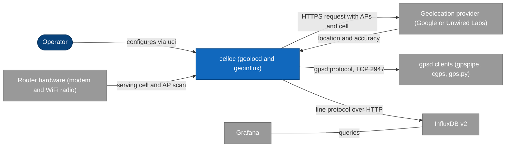
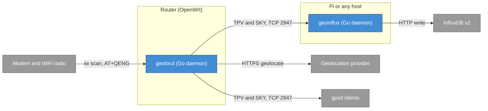
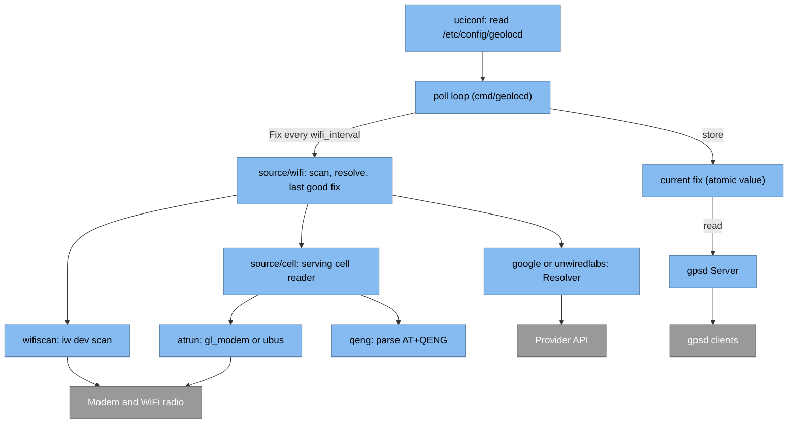
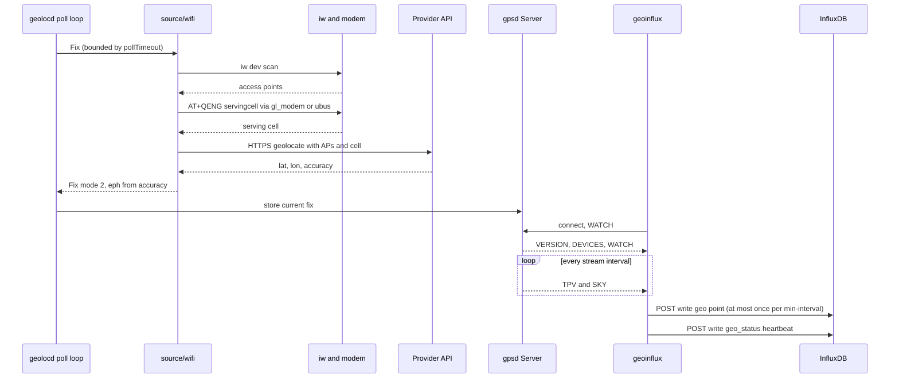
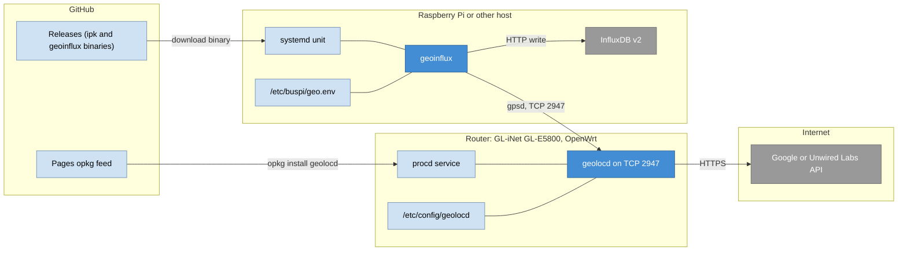

# Architecture

celloc turns a cellular modem's serving-cell identity (plus nearby WiFi access points) into a
position and serves it over the gpsd protocol, with an optional uploader to InfluxDB. This page is
the single architecture description.

## 1. Introduction and goals

A router with a cellular modem but no GNSS antenna still needs a position. celloc supplies one:

- **`geolocd`** runs on a GL-iNet / OpenWrt router. It scans WiFi, reads the modem's serving cell
  (`AT+QENG`), asks a geolocation provider to resolve both together, and serves the result on a
  real gpsd socket (TCP `2947`), so any gpsd client can consume it.
- **`geoinflux`** runs on a Pi or any host. It is a gpsd client that writes each fix to InfluxDB.

Quality goals, in priority order:

1. **Honest positioning data.** A WiFi or cell fix is never presented as a GPS fix (section 8).
2. **Unattended operation.** Bounded timeouts, reconnects and throttled logs keep both daemons
   running without a babysitter (section 10).
3. **Testability.** Parsing and marshaling are pure; I/O sits behind small injected interfaces
   (section 5).

For a first run see [Getting started](getting-started.md).

## 2. Constraints

| Constraint | Source |
| --- | --- |
| Go, standard library only (no third-party modules) | `go.mod` has no `require` lines |
| `geolocd` is a static `CGO_ENABLED=0` binary for OpenWrt (arm64), so it needs no libc on the router | `packaging/openwrt/build-ipk.sh`, `Makefile` |
| The router is reached through its own tools: `iw` for the WiFi scan, `gl_modem` or `ubus` for AT commands, `uci` for configuration | `internal/wifiscan`, `internal/atrun`, `internal/uciconf` |
| The modem speaks Quectel `AT+QENG="servingcell"` | `internal/qeng` |
| The output speaks the JSON subset of gpsd protocol 3.14 | `internal/gpsd` |
| Provider keys and the InfluxDB token never appear in argv or logs | [SECURITY](https://github.com/ckeller42/celloc/blob/main/SECURITY.md) |
| No deployment specifics (real keys, hosts, coordinates) in the repository | [AGENTS](https://github.com/ckeller42/celloc/blob/main/AGENTS.md) |

## 3. Context and scope

celloc as one system among its users and neighbours.

Scope boundary: celloc owns everything from the AT and WiFi reads to the InfluxDB write. It does
not own the modem, the provider's database, InfluxDB or Grafana. It sends **BSSIDs of nearby
networks and the serving cell** to the configured provider, and nothing else.

| Neighbour | Interface |
| --- | --- |
| Router hardware | `iw dev <if> scan` and `AT+QENG="servingcell"` through `gl_modem` or `ubus` |
| Provider | Google `POST /geolocation/v1/geolocate`, or Unwired Labs `POST /v2/process.php` |
| gpsd clients | [gpsd output](reference/gpsd.md) on TCP `2947` |
| InfluxDB | `POST /api/v2/write` with `precision=ns`, see [InfluxDB schema](reference/influxdb.md) |

## 4. Solution strategy

| Goal | Approach |
| --- | --- |
| Consumable by existing software | Speak gpsd, not a private protocol. One unauthenticated TCP socket, `?WATCH`, `?POLL`, `?VERSION`, `?DEVICES` |
| Accurate without GNSS | One WiFi source that sends scanned APs **and** the serving cell in a single provider request, so the provider fuses them. The cell anchors the fix when APs are sparse |
| Never lie about the fix | TPV `mode=2` with `eph==epx==epy` from the provider's accuracy and no `alt`/`speed`/`track`. No fix or a stale fix is `mode=0` with no coordinates |
| Easy to test | Pure parsing and marshaling packages. Subprocesses and HTTP are injected (`Exec`, `Doer`, clock) |
| Survive failures | Per-call timeouts, cached fix until stale, reconnect loop, rate-limited logs |
| Keep secrets off the command line | Router config from uci, Pi config from an environment file |

## 5. Building blocks

### Level 1: containers

The two deployable programs and what they talk to.

### Level 2: `geolocd` components

The router daemon's building blocks. `cmd/geolocd` wires the blocks together.

### Package map and the pure vs I/O split

Mirroring the seed project, parsing/marshaling is pure (no network, filesystem, env, or
wall-clock) so it is exhaustively table-testable; I/O sits behind small injected interfaces.

| Package | Kind | Responsibility |
| --- | --- | --- |
| `internal/qeng` | pure | parse `AT+QENG="servingcell"` → cells (skipping a leading `"servingcell",<state>` prefix); pick the geolocatable cell — LTE (also the NSA anchor), else NR5G-SA |
| `internal/gpsd` | pure reports + I/O `Server`/`Client` | gpsd TPV/SKY/VERSION/POLL |
| `internal/source` | pure | `Source` interface, `Fix` value type, `ErrNoFix` |
| `internal/source/cell` | I/O | `ServingCellReader` (AT+qeng → serving cell for blending) |
| `internal/geoloc` | pure | neutral `Location{Lat,Lon,Accuracy}` shared by resolvers |
| `internal/wifiscan` | pure parse + I/O scanner | `iw dev <if> scan` → `[]AP` |
| `internal/unwiredlabs` | pure `ParseResponse` + I/O `Client` | LocationAPI `process.php` |
| `internal/google` | pure `ParseResponse` + I/O `Client` | Google `geolocate` |
| `internal/source/wifi` | I/O (compose) | scan + resolve + cache, behind a neutral `Resolver` |
| `internal/atrun` | I/O (`Exec`) | run AT via `gl_modem` / `ubus` |
| `internal/influx` | pure `FixLine`/`StatusLine` + I/O `Writer` (`Doer`) | `geo` + `geo_status` line protocol + write (`precision=ns`) |
| `internal/uciconf` | pure parse + I/O load | read `/etc/config/geolocd` via uci |
| `internal/ratelog` | helper (injectable clock) | throttle repeated log lines (per key, once a minute by default) so a persistent failure doesn't flood the router's log buffer |
| `cmd/geolocd` | wiring | uci → source → poll loop → gpsd server |
| `cmd/geoinflux` | wiring | gpsd client → InfluxDB (reconnect, debounce) |

### Pluggable sources (GNSS-ready)

`source.Source` is a small interface (`Name`, `Fix`). `geolocd` runs a **single
WiFi source** that blends the serving cell into the provider request (via
`cell.ServingCellReader`); the resolver is provider-pluggable (`google` default,
`unwiredlabs` optional) selected by uci `wifi_provider`. A future GNSS source
(`AT+QGPS`, once an antenna exists) just implements `source.Source` — no change
to the poll loop or server.

## 6. Runtime view

### One data-flow cycle

The poll loop and the stream loop run independently: the fix is refreshed every `wifi_interval`,
the TPV stream ticks every `-stream` interval, and the uploader debounces its writes to
`-min-interval`.

### Steps in detail

1. `geolocd` poll loop (every `wifi_interval`) calls the WiFi `source.Fix`:
   `wifiscan` runs `iw scan`, `cell.ServingCellReader` reads the serving cell
   (`atrun`+`qeng`), and the provider (`google`/`unwiredlabs`) resolves the WiFi
   APs + cell together. Each call is bounded by `pollTimeout` (60 s), and each
   AT subprocess (`gl_modem`/`ubus`) by `atrun.ExecTimeout` (20 s), so a hung
   modem helper or provider can't stall the loop. A failed or timed-out poll
   falls back to the source's cached fix while it is younger than `StaleAfter`,
   and otherwise serves no-fix (`mode=0`).
2. The fix is cached (served until `StaleAfter`, which is `2 × wifi_interval`
   floored at 2 min) and stored atomically.
3. The gpsd `Server` streams `TPVFromFix` to watching clients every `-stream`
   interval (default 1 s) and answers `?POLL`/`?WATCH`/`?VERSION`.
4. `geoinflux` (Pi) watches the socket, converts each TPV back to a `Fix`
   (`FixFromTPV`), and for `mode>=2` writes `influx.FixLine` (measurement
   `geo`, stamped with the fix's own time) to the configured bucket (default
   `buspi`), at most once per `-min-interval`. A fix with neither `wifix` nor
   `cellfix` is skipped (logged, rate-limited); `FixLine` refuses it with
   `ErrUnattributedFix`.
5. Alongside, `geoinflux` writes an `influx.StatusLine` heartbeat (measurement
   `geo_status`: `mode`, `fix_age_s`, `connected`) at most once per
   `-min-interval`, and immediately when the gpsd connection drops or comes
   back — so a dead uploader, an unreachable router, no fix and a stale fix
   are distinguishable in InfluxDB. Schemas: [InfluxDB schema](reference/influxdb.md).

### Degraded paths

| Situation | Behaviour |
| --- | --- |
| Scan fails or finds fewer than `wifi_min_aps` APs, serving cell available | AP set is dropped, the fix resolves from the cell alone and is tagged `source=cell` |
| Serving cell unreadable, enough APs | Resolves from WiFi only (`source=wifi`) |
| Neither APs nor cell | The poll fails and falls back to the cached fix while it is younger than `StaleAfter` |
| Provider error or timeout | Logged (throttled), cached fix served until stale, then `mode=0` |
| Router gpsd unreachable | `geoinflux` writes `geo_status connected=false` and reconnects every 10 s |
| Stalled gpsd connection | `geoinflux` read deadline of 90 s forces a reconnect |

## 7. Deployment view

Where each program runs and how it gets there.

- **Router.** The `.ipk` (aarch64, `aarch64_cortex-a53`) installs the binary at `/usr/bin/geolocd`,
  a procd init script (respawn with no retry limit, reload on `/etc/config/geolocd` changes) and a
  default `/etc/config/geolocd` kept across upgrades. `:2947` listens on all interfaces; the default
  OpenWrt firewall drops inbound WAN.
- **Pi or host.** `geoinflux` is installed at `/usr/local/bin/geoinflux` and runs under
  `pi/geoinflux.service` with its settings in `/etc/buspi/geo.env` (mode `0600`). Releases carry
  builds for `linux_arm64`, `linux_armv7` and `linux_amd64`.
- **Delivery.** Releases build and attach the artifacts; the Pages workflow indexes them as an opkg
  feed. A firmware flash replaces the router rootfs, so the package must be reinstalled; see
  [Install and operate](INSTALL.md).

## 8. Crosscutting concepts

### Honest gpsd semantics

Neither a WiFi nor a cell fix is a GPS fix. It is emitted as TPV `mode=2` with
`eph==epx==epy` set to the provider's accuracy/error radius, and **no**
`alt`/`speed`/`track`. A no-fix or stale position is `mode=0` with no coordinates.
A WiFi-dominant fix carries a non-standard `wifix` object (`ap_count`); a
cell-only fix carries `cellfix` (mcc/mnc/cid/tac/radio). Both are ignored by
standard gpsd clients and read by `geoinflux` to tag the InfluxDB point; a fix
TPV carrying neither is not a celloc fix, and `geoinflux` writes no `geo` point
for it rather than invent a `source` tag. The `SKY` report lists no satellites and
carries no DOP values. Field-level detail: [gpsd output](reference/gpsd.md).

### Secrets and privacy

Provider keys live in uci on the router and are read by `geolocd` itself; the Google client strips
the request URL (which holds the key) from transport errors before logging. The InfluxDB token is
read from `INFLUXDB_TOKEN` only; `geoinflux` exits if it is unset. WiFi geolocation sends the
BSSIDs of nearby networks to the provider, except APs whose SSID ends in `_nomap`.
See [SECURITY](https://github.com/ckeller42/celloc/blob/main/SECURITY.md).

### Timeouts, retries and log throttling

`pollTimeout` 60 s per fix, `atrun.ExecTimeout` and `wifiscan.ExecTimeout` 20 s per subprocess, 15 s
per provider HTTP request, 10 s per InfluxDB write, 90 s gpsd read deadline, 10 s reconnect delay.
Repeated failures are logged through `ratelog` (once a minute per key) so the router's small log
buffer is not flooded.

### Configuration

`geolocd` takes all configuration from uci and has one flag, `-stream`. `geoinflux` takes flags
overriding environment variables overriding defaults. See [Configuration](reference/config.md).

## 9. Architecture decisions

Dated records are not kept separately; the decisions below are visible in the code and its
comments.

| Decision | Consequence |
| --- | --- |
| Serve gpsd rather than a custom API | Any gpsd client works. Position quality is conveyed through `mode` and `eph`, and celloc adds only the `wifix`/`cellfix` extension objects |
| One WiFi source blending the cell into the provider request (OpenCelliD is no longer used) | A single provider call per cycle. The cell anchors the fix when APs are sparse |
| Provider behind a `Resolver` interface (`google` default, `unwiredlabs` optional) | A provider is swapped with one uci option |
| Pure parsing, injected I/O | Parsers are table-tested without a router or network |
| Standard library only | Small static binary for the router, no dependency updates besides Go and CI actions |
| No fabricated data | A fix without a celloc source is not written to InfluxDB; a missing coordinate is never turned into 0,0 |
| Debounce attempts, not only successes | A failing InfluxDB is not hammered every second |

## 10. Quality requirements

| Quality | How it is met | Evidence |
| --- | --- | --- |
| Correctness of data | Honest TPV, unattributed fixes refused | `internal/gpsd`, `internal/influx` tests |
| Robustness | Timeouts, cache until stale, reconnect, procd respawn without retry limit | `cmd/geolocd`, `cmd/geoinflux`, `packaging/openwrt/files/geolocd.init` |
| Observability | Fix acquired and lost transitions logged once, `geo_status` heartbeat in InfluxDB | `cmd/geolocd`, `cmd/geoinflux` |
| Test coverage | At least 85% over `./internal/...`, enforced in CI, `go test -race` | `.github/workflows/ci.yml` |
| Supply chain | SHA-pinned actions, gitleaks, `govulncheck` | `.github/workflows/` |

## 11. Risks and technical debt

- **Accuracy.** A cell-only fix is typically hundreds of metres to a few km; WiFi improves this only
  with a provider key and mapped APs nearby. The error radius is reported honestly in `eph`.
- **Provider cost and plans.** Google's free tier covers 10,000 requests per month; one request per
  poll at the default 300 s interval is 288 per day. Unwired Labs WiFi geolocation must be enabled for the account, and eligibility and plan terms may vary.
- **Unauthenticated gpsd.** `:2947` has no authentication, like upstream gpsd. It must stay LAN-only.
- **NR5G-NSA and NR5G-SA.** An NSA line carries no cell IDs, so the LTE anchor is used. The NR5G-SA
  decoder is marked best-effort in the code.
- **Router firmware upgrades** wipe the package. A keep-settings sysupgrade preserves the config;
  [Install and operate](INSTALL.md) describes the auto-restore.
- **No GNSS source yet.** The interface is ready, there is no implementation.

## 12. Glossary

| Term | Meaning |
| --- | --- |
| AP, BSSID | WiFi access point and its MAC address, as seen in `iw` scan output |
| MCC, MNC | Mobile country code and mobile network code of the serving cell |
| CID, TAC | Cell identity and tracking area code (hex in the AT reply, decimal in celloc) |
| LTE, NR5G-NSA, NR5G-SA | Radio technologies in `AT+QENG` lines. NSA is 5G anchored on an LTE cell |
| `AT+QENG` | Quectel modem command that reports the serving cell |
| gpsd | Daemon and JSON protocol that location clients speak. celloc implements a subset |
| TPV, SKY | gpsd time-position-velocity and satellite reports |
| `eph`, `epx`, `epy` | Estimated horizontal error radius, and per-axis error, in metres |
| `wifix`, `cellfix` | celloc's non-standard TPV objects that say what resolved the fix |
| uci | OpenWrt's configuration system |
| procd | OpenWrt's service supervisor |
| opkg, ipk | OpenWrt's package manager and its package format |
| Fix | `source.Fix`, celloc's internal position estimate |
